# Motion-to-Motion Latency Measurement System for Raspberry Pi  

The system includes:

- Raspberry Pi GPIO interrupt handling  
- A custom Linux kernel module  
- Chrony-based time synchronization  
- Client/server C++ synchronization test applications  
- Automated export of GPIO interrupt timestamps  

This README provides everything needed to install, configure, and run the full system.

### Abreviations
- RPI : Raspberry Pi

---

# 1. Repository Structure

---

```
.
├── App/
│   ├── sync_test_client.cpp
│   └── sync_test_server.cpp
├── Module/
│   ├── Makefile
│   ├── export.sh
│   ├── gpio16_irq.c
│   └── gpio16_irq.dts
├── Results/
│   ├── Motion-to-Motion
|   |   ├── Dynamic_Autonomous.csv
|   |   ├── Dynamic_Co_Referenced.csv
|   |   ├── Static_5G.csv
|   |   └── Static_Wifi.csv
│   └── Synchronization
|       ├── Autonomous.csv
|       └── Co_Referenced.csv
├── Images/
│   └── Images content in README.md
└── README.md
```

---

# 2. Install Ubuntu Server

---

### Install [PI Imager](https://www.raspberrypi.com/software/)

- Configuration
  <table>
  <tr>
    <td style="border-right:1px solid #888;">Raspberry Pi device</th>
    <td>Raspberry Pi 5</th>
  </tr>
  <tr>
    <td style="border-right:1px solid #888;">Operating System</td>
    <td> Other general-purpose OS 
        <ul>
            <li> Ubuntu
                <ul>
                    <li> Ubuntu Server 24.04.3 LTS (64-bit)
                </ul>
            </li>
        </ul>
    </td>        
  </tr>
  <tr>
    <td style="border-right:1px solid #888;">Storage</td>
    <td>SD Card</th>
  </tr>
  </table>

  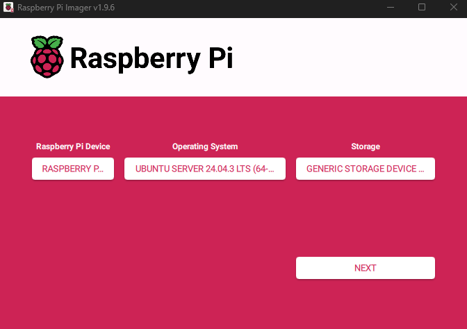


### Choose Edit settings

- Configure user name and password

  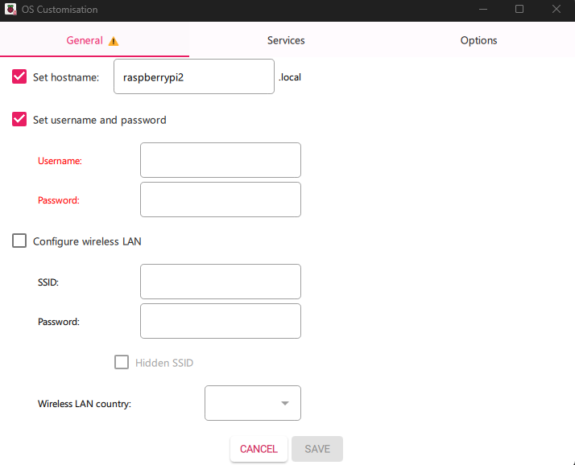

- Generate SSH key
  ```bash
  ssh-keygen -t ed25519 -C "your_email"
  ```

- Add SSH key for remote access

  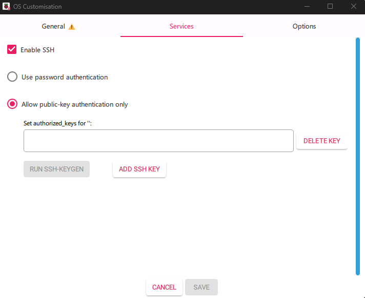

### Remote access

- Get Raspberry Pi ip address
  ```bash
  hostname -I
  ```

- Use IP and user name for remote access

  ```bash
  ssh pi_user_name@Pi_ip_dddress
  ```

- **Note: Computer and [RPI](#abreviations) should be on the same network**

---

# 3. Required Packages

---

- Install the required system packages :
  ```bash
  sudo apt install build-essential libgpiod-dev rt-tests linux-tools-common linux-tools-$(uname -r) wireless-tools gpiod chrony network-manager linux-headers-$(uname -r)
  ```
  ### Package Overview
  | Package | Purpose |
  |--------|----------|
  | **build-essential** | GCC/G++ and essential build tools |
  | **libgpiod-dev**, **gpiod** | GPIO control library and CLI |
  | **rt-tests** | Includes `cyclictest` for real-time analysis |
  | **wireless-tools**, **network-manager** | Network utilities |
  | **linux-tools-\***, **linux-headers-\*** | Required for kernel module |
  | **chrony** | NTP-based time synchronization tool |

---

# 4. Clock Synchronization

---

### Check status
  ```bash
  systemctl status chronyd
  ```
### Start Chrony and enable at boot
  ```bash
  sudo systemctl start chronyd
  systemctl enable chronyd
  ```

### Restart Chrony
  ```bash
  systemctl restart chrony
  ```

### Check Chrony sources
  ```bash
  chronyc sources
  ```
### Check Chrony tracking
  ```bash
  chronyc tracking
  ```
### Modify update interval
  ```bash
  sudo nano /etc/chrony/chrony.conf
  ```
  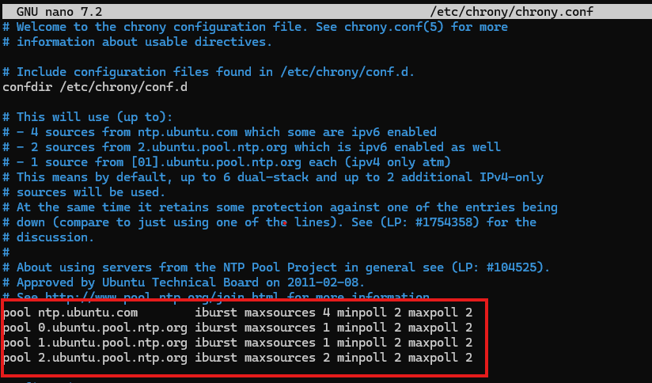

  - **minpoll** and **maxpoll** specify the range for update interval. 2-> 2^2 = 4 seconds

## 4.1. Configure for co-reference mode
- **RPI-Ref** = Raspberry Pi used as reference
- **RPI-Peer** = Raspberry Pi synchronizing to RPI-Ref

### On RPI-Ref
- Open chrony config file
  ```bash
  sudo nano /etc/chrony/chrony.conf
  ```
- Allow RPI-Peer to access RPI-Ref

  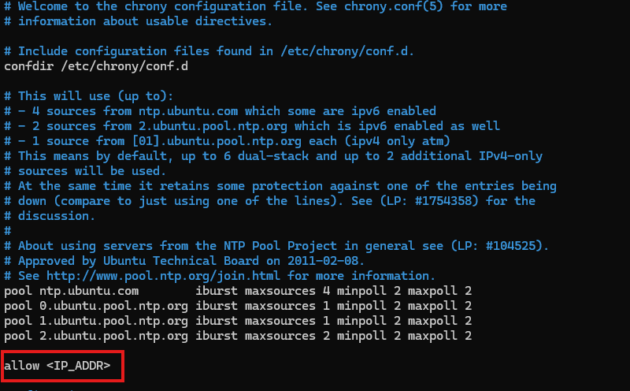

- [Restart Chrony to apply changes](#restart-chrony)

- [Check Chrony sources and tracking status](#check-chrony-sources)


### On RPI-Peer
- Open chrony config file
  ```bash
  sudo nano /etc/chrony/chrony.conf
  ```
- Define RPI-Ref as synchronization source on RPI-Peer

  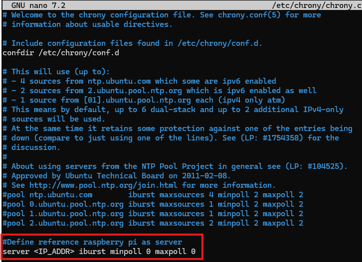

- [Restart Chrony to apply changes](#restart-chrony)

- [Check Chrony sources and tracking status](#check-chrony-sources)


## 4.2 Attach Chrony to a particular core
### Get chrony daemon (chronyd) process id (pid)
  ```bash
  ~$ pidof chronyd
  924 923
  ```

### Check the cores running the process
  ```bash
  ~$ sudo taskset -pc 923
  pid 923's current affinity list: 0-3
  ```
  ```bash
  ~$ sudo taskset -pc 924
  pid 924's current affinity list: 0-3
  ```

### Pin process to a particular core
  ```bash
  ~$ sudo taskset -pc 0 923
  pid 923's current affinity list: 0-3
  pid 923's new affinity list: 0
  ```
  ```bash
  ~$ sudo taskset -pc 0 924
  pid 924's current affinity list: 0-3
  pid 924's new affinity list: 0
  ```
---

# 5. Install system

---

## 5.1. Add device tree overlays for GPIO
- [In Module folder](#1-repository-structure)

### Build and load dts file
This configures your gpio descriptor used in C module

  ```bash
  dtc -@ -I dts -O dtb -o gpio16_irq.dtbo gpio16_irq.dts
  sudo cp gpio16_irq.dtbo /boot/firmware/overlays
  ```
  Note:
  ```bash
  sudo rm /boot/firmware/overlays/gpio16_irq.dtbo # Unload 
  ```

### Add overlay to boot config file
  ```bash
  sudo nano /boot/firmware/config.txt
  ```
  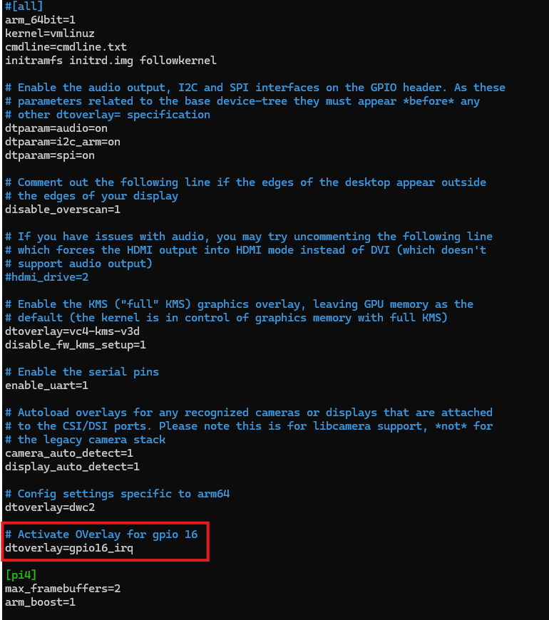

### Reboot the device to apply changes
  ```bash
  sudo reboot
  ```

## 5.2. Build and load kernel module
- [In Module folder](#1-repository-structure)
### Build module
  ```bash
  make clean && make
  ```
### load module into kernel
  ```bash
  sudo insmod gpio16_irq.ko
  ```
### Check if module has been loaded
  ```bash
  $ sudo lsmod | grep gpio16_irq
  gpio16_irq             12288  0
  ```

### Check for error in kernel ring buffer
  ```bash
  $ sudo dmesg | tail -n 4
  [ 5628.557571] gpio16_irq: loading out-of-tree module taints kernel.
  [ 5628.557889] GPIO irq Sync Time : 1763574700823754028
  [ 5628.557950] gpio_irq_driver gpio_irq_node: GPIO IRQ number: 187
  [ 5628.557973] gpio_irq_driver gpio_irq_node: GPIO IRQ module loaded (IRQ 187)
  ```

### Check if the GPIO is used by your module
  ```bash
  sudo gpioinfo
  ```

  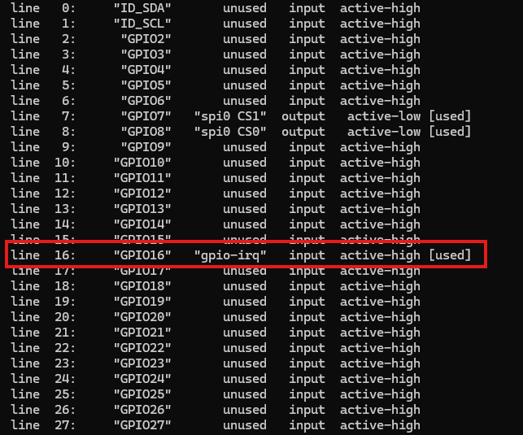

- **DO NOT REBOOT OR MODULE WILL UNLOADED**
  - Unload manually
    ```bash
    sudo rmmod gpio16_irq
    ```

## 5.3. Modify interrupt trigger
### Update trigger type in DTS
  > interrupts = <16 2>;

  > interrupts = <gpio_num trigger_type>;

  #### Trigger Types
  <table>
    <tr>
      <th style="border-right:1px solid #888;">Number</th>
      <th>Interrupt Triggers</th>
    </tr>
    <tr>
      <td style="border-right:1px solid #888;">0 -> 0b0000</td>
      <td>Undefined</td>
    </tr>
    <tr>
      <td style="border-right:1px solid #888;">1 -> 0b0001</td>
      <td>Rising Edge</th>
    </tr>
    <tr>
      <td style="border-right:1px solid #888;">2 -> 0b0010</td>
      <td>Falling Edge</th>
    </tr>
    <tr>
      <td style="border-right:1px solid #888;">4 -> 0b0100</td>
      <td>Level High</th>
    </tr>
    <tr>
      <td style="border-right:1px solid #888;">8 -> 0b1000</td>
      <td>Level Low</td>
    </tr>
    <tr>
    <tr>
    <td colspan="2">
      Any number from 1 to 15 is valid <br>
      15 → 0b1111 meaning all triggers are selected
    </td>
  </tr>
  </tr>
  </table>

### Update trigger type in C module

  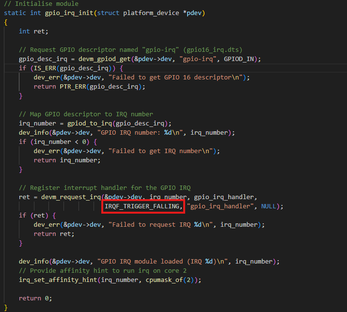

  #### Trigger FLags
  <table>
    <tr>
      <th style="border-right:1px solid #888;">Trigger</th>
      <th>FLAG</th>
    </tr>
    <tr>
      <td style="border-right:1px solid #888;">Rising Edge</td>
      <td>IRQF_TRIGGER_RISING</th>
    </tr>
    <tr>
      <td style="border-right:1px solid #888;">Falling Edge</td>
      <td>IRQF_TRIGGER_FALLING</th>
    </tr>
    <tr>
      <td style="border-right:1px solid #888;">Level High</td>
      <td>IRQF_TRIGGER_HIGH</th>
    </tr>
    <tr>
      <td style="border-right:1px solid #888;">Level Low</td>
      <td>IRQF_TRIGGER_LOW</th>
    </tr>
  </table>

  ### For multiple trigger use the notation "FLAG1 | FLAG2 | ..." 
  

### [Rebuild](#build-and-load-dts-file)

**Note: To modify GPIO used as interrupt, in DTS files:**

- interrupts = <gpio_num trigger_type>;
- gpio-irq-gpios = <&gpio gpio_num trigger_type>;
- if **GPIO_16_IRQ:** is modified in module, it mush must modifed everywhere else (cpp apps and export.sh)

## 5.4. Read interrupt events logs
### Acces the ring buffer
- Timestamps are looged into the ring buffer
  ```bash
  sudo dmesg
  ```

- Monitor in real-time
  ```bash
  sudo dmesg --follow
  ```

### Clear ring buffer 
- Must be done in between experiments to prevent mixing old ones with new ones
  ```bash
  sudo dmesg -C
  ```

## 5.5. Export results
- [In Module folder](#1-repository-structure)
### Launch export.sh
  ```bash
  bash export.sh "gpio number" "name"
  ```
  Exemple:
  ```bash
  bash export.sh 16 vehicle_event
  ```
  - **Important: If ring buffer was not cleared every experiment will be mixed together into the same csv**

## 5.6. Ouput data
Provide a csv containing
- Timestamps separated into two column, seconds and remaining nanoseconds
- Each export must be done on each [RPI](#abreviations), then regroup the data

---

# 6. Run synchronisation test application

---


- [In App folder](#1-repository-structure)

The full application is separated into sync_test_client and sync_test_server, each must be launched in one of the RPI
- **RPI-Client** = Raspberry Pi launching sync_test_client.cpp
- **RPI-Server** = Raspberry Pi launching sync_test_server.cpp

## 6.1. Hardware

- On RPI-Client, connect GPIO 17 to its own and RPI-Server GPIO-16 each via a 1kΩ resitor.
- Connect RPI-Client and RPI-Server GND pins.

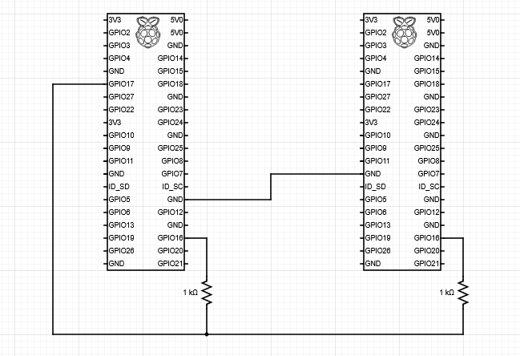

## 6.2. CLient side
### Build and run 
  ```bash
  g++ -o sync_test_client sync_test_client.cpp -lgpiod
  sudo taskset -c 3 chrt -f 99 ./sync_test_client
  ```
### Modify ip address to RPI-Server

  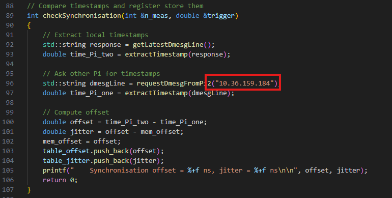

### Modify the number of iterations

  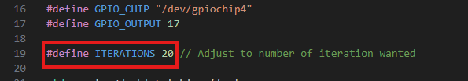

### Modify Result file location

  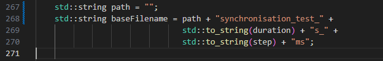

### Modify toggle time

  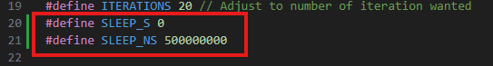

## 6.3. Server side
### Build and run 
  ```bash
  g++ -o sync_test_server sync_test_server.cpp
  sudo taskset -c 3 chrt -f 99 ./sync_test_server
  ```
## 6.4. Ouput data
Provide a csv containing
- synchronization offset in nanoseconds and absolute milliseconds
- offset jitter in nanoseconds and absolute value milliseconds
- GPIO trigger time (set to LOW) in nanoseconds and converted to seconds starting from 0

## 6.5. Notes
 - **sudo taskset -c 3 chrt -f 99** launch programs at maxmium priority on core 3. It is needed for the GPIO to be set as fast as possible
 - **sync_test_server** must be run before **sync_test_client**
 - [WinSCP](https://winscp.net/eng/download.php) was used to transfert files between computer and [RPI](#abreviations) devices

---

# 7. About Motion-to-Motion

---

To test system for Motion-to-Motion latency, on each [RPI](#abreviations):

- [Build and load dts and kernel module](#install-system)
- Connect Hall-effect sensor, Sensor_1 and Sensor_2 in schematic, to [RPI](#abreviations) pins

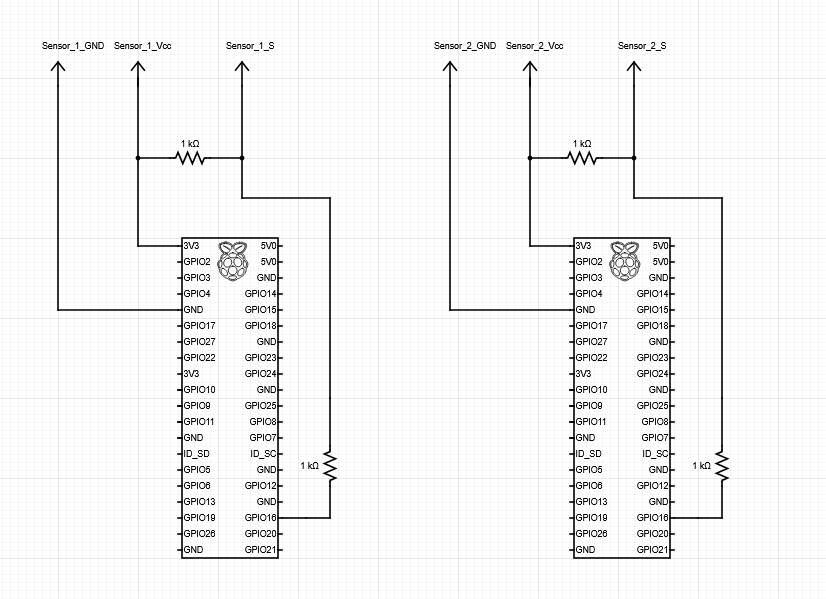

You can now try to put magnets in front of both sensors and [check interrupts in real-time](#54-read-interrupt-events-logs)

---

# 8. Summary

---

This repository provides:

- Precise GPIO interrupt timestamping  
- A custom Linux kernel module  
- Chrony-based time synchronization  
- Real-time optimized client/server applications  
- CSV export tools  

Ideal for:

- distributed time sync research  
- V2X timing systems  
- embedded real-time applications  
- latency and jitter studies  

---

# Contributions

---

Issues and pull requests are welcome!